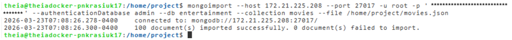
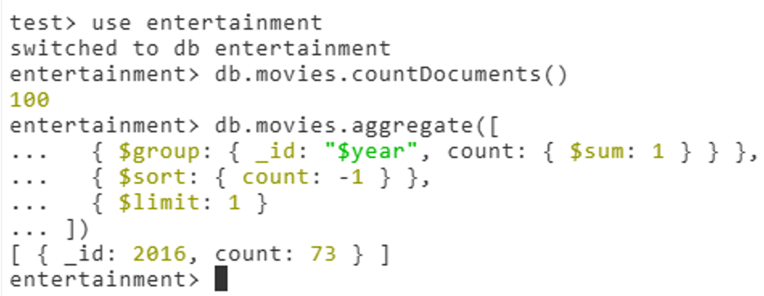
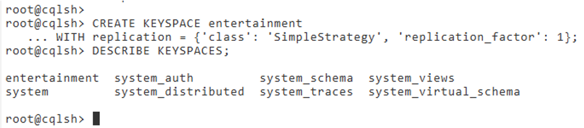
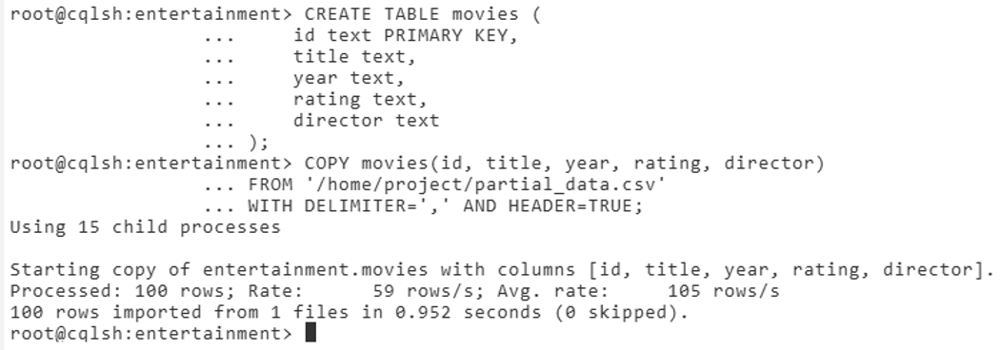
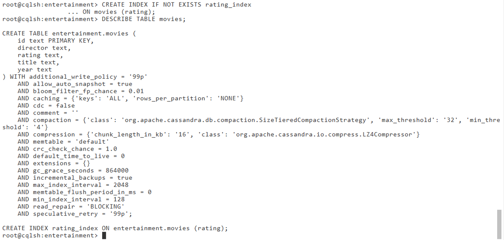

# 🎬 Movies Data Engineering Pipeline


[](LICENSE)

---

## ✅ Project Status
This project is fully implemented and tested in a controlled lab environment.  
It demonstrates a complete **end-to-end data engineering pipeline** using NoSQL technologies.  
Open for future improvements and extensions.

---

## 📌 Project Overview

This project implements a practical end-to-end data pipeline for processing movie data.
The pipeline demonstrates data ingestion, transformation, and loading across multiple systems.

### 🔹 MongoDB (Data Ingestion & Processing)
- Imports JSON dataset into MongoDB
- Performs analytical queries using aggregation pipelines:
  - Grouping
  - Sorting
  - Filtering
  - Average calculations

### 🔹 Data Export
- Extracts selected fields from MongoDB
- Converts data into CSV format for downstream processing

### 🔹 Cassandra (Data Storage & Querying)
- Loads transformed data into Cassandra
- Creates schema with all fields stored as `text`
- Builds an index for optimized querying
- Performs analytical queries using CQL

This project demonstrates **data movement between systems**, a key skill in Data Engineering.

---

## 📁 Project Structure
```
movies-data-engineering-pipeline/
├── data/                         ← Source and processed data files
│   ├── movies.json               ← Raw dataset (input)
│   └── partial_data.csv          ← Exported dataset from MongoDB
│
├── mongo/
│   ├── mongo_commands.txt        ← MongoDB import/export commands
│   └── mongo_queries.js          ← Aggregation and query scripts
│
├── cassandra/
│   ├── schema.cql                ← Keyspace and table definitions
│   └── queries.cql               ← Cassandra queries and index creation
│
├── screenshots/                  ← Execution proofs (lab validation)
│   ├── mongo_import.png          ← MongoDB import result
│   ├── aggregation.png           ← Aggregation query result
│   ├── export.png                ← CSV export confirmation
│   ├── cassandra_keyspace.png    ← Keyspace creation in Cassandra
│   ├── cassandra_copy.png        ← Data load into Cassandra
│   └── index.png                 ← Index creation proof
│
├── LICENSE                       ← MIT License
└── README.md                     ← Project documentation
```
---

## 🛠️ Skills & Tools
- MongoDB — NoSQL document database  
- Mongo Shell (`mongosh`) — query execution  
- Mongo Import / Export — data ingestion and extraction  
- Apache Cassandra — distributed NoSQL database  
- CQL (`cqlsh`) — querying Cassandra  
- JSON & CSV — data formats  
- Linux CLI — working with data pipelines  

---

## 🚀 Pipeline Workflow

### 1️⃣ Data Ingestion (MongoDB)
- Imported `movies.json` into MongoDB  
- Database: `entertainment`  
- Collection: `movies`  

### 2️⃣ Data Processing (MongoDB)
- Identified year with the highest number of movies  
- Counted movies released after 1999  
- Calculated average votes for movies in 2007  

### 3️⃣ Data Export
- Exported selected fields:  
  - `_id`, `title`, `year`, `rating`, `Director`  
- Generated `partial_data.csv`  

### 4️⃣ Data Loading (Cassandra)
- Created keyspace: `entertainment`  
- Created table with all columns as `text`  
- Loaded CSV data into Cassandra  

### 5️⃣ Data Querying (Cassandra)
- Counted total records  
- Created index on `rating`  
- Queried number of movies with rating `'G'`  

---

## 🔄 Data Flow Diagram

```text
        movies.json
             │
             ▼
          MongoDB
   (aggregation & queries)
             │
             ▼
      partial_data.csv
             │
             ▼
         Cassandra
     (index & queries)
```
---

## 📸 Execution Screenshots

### MongoDB Import


### Aggregation Query Result


### Data Export


### Cassandra Keyspace Creation


### Cassandra Data Load


### Index Creation


---

## 🔎 Key Engineering Highlights
- End-to-end data pipeline across two NoSQL systems  
- Demonstrates data transformation between formats (JSON → CSV)  
- Uses MongoDB aggregation pipelines  
- Implements Cassandra schema and indexing  
- Shows real-world data movement between systems  
- Clean and modular project structure  

---

## 📝 Results
- Movies imported into MongoDB: **100**  
- Year with most movies: **2016**  
- Movies released after 1999: **99**  
- Average votes (2007): **192.5**  
- Rows loaded into Cassandra: **100**  
- Movies with rating `'G'`: **32**  

---

## 📝 Summary
- Built a cross-database data pipeline  
- Practiced MongoDB aggregation queries  
- Transferred data between systems  
- Worked with Cassandra schema and indexing  
- Demonstrated core Data Engineering concepts including ETL, data transformation, and cross-system data integration

---

## 👩‍💻 Author

**Palina Krasiuk**  
Aspiring Cloud Data Engineer | ex-Senior Accountant  
[LinkedIn](https://www.linkedin.com/in/palina-krasiuk-954404372/) • [GitHub Portfolio](https://github.com/CloudDataPalina)
